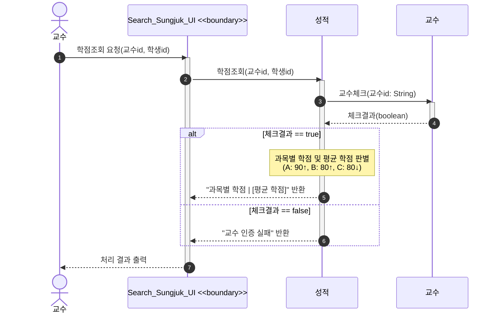

```mermaid
sequenceDiagram
    autonumber
    actor 교수
    participant UI as Search_Sungjuk_UI <<boundary>>
    participant Score as 성적
    participant Prof as 교수

    교수->>UI: 학점조회 요청(교수id, 학생id)
    activate UI

    UI->>Score: 학점조회(교수id, 학생id)
    activate Score

    Score->>Prof: 교수체크(교수id: String)
    activate Prof
    Prof-->>Score: 체크결과(boolean)
    deactivate Prof

    alt 체크결과 == true
        Note over Score: 과목별 학점 및 평균 학점 판별<br/>(A: 90↑, B: 80↑, C: 80↓)
        Score-->>UI: "과목별 학점 | [평균 학점]" 반환
    else 체크결과 == false
        Score-->>UI: "교수 인증 실패" 반환
    end
    deactivate Score

    UI-->>교수: 처리 결과 출력
    deactivate UI
```
